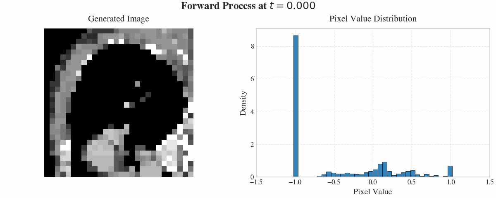
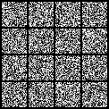
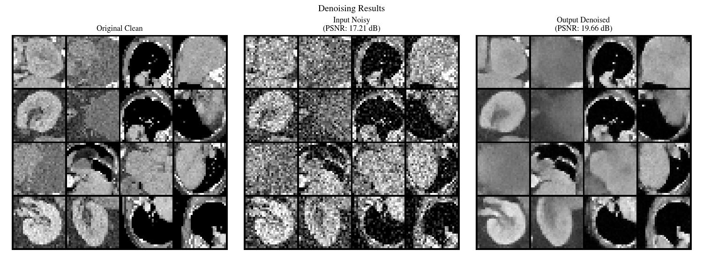

# Diffusion Model for Generative Denoising on OrganAMNIST

A conditional(Diffusion Posterior Sampling) generative denoising framework using diffusion model for the OrganAMNIST dataset from MedMNIST. 
The implementation is based on score-based generative modeling through stochastic differential equations (SDEs).

Follows the Variance Preserving Stochastic Differential Equation (VP-SDE) formulation:

x\,dt+\sqrt{\beta(t)}dw%7D)

where β(t) follows a cosine schedule. 
The forward process gradually adds noise to transform data distribution into a standard normal distribution, while the reverse process performs denoising.

The score network s_θ(x_t, t) is trained with a combined loss function:

where:
- -\epsilon\bigr\|_2^2%7D)
- -\mathcal{F}(x_0)\bigr\|_1%7D)

The frequency domain loss $\mathcal{L}_{\text{freq}}$ improves the reconstruction of high-frequency details.

The model uses a U-Net architecture with self-attention modules containing:
- Time-dependent embeddings
- Skip connections
- Self-attention mechanism (8 heads)
- 6.6M parameters

### Forward Process (Data → Noise)

### Reverse Process (Noise → Data)

### Denoising Performance
The diffusion model achieves effective generative denoising on the OrganAMNIST dataset with:
- Noise level σ = 0.3
- 1000 sampling steps
- Improved PSNR from 17.21 dB to 19.66 dB (+2.44 dB)
- Comparable SSIM (0.5372 → 0.5364)

